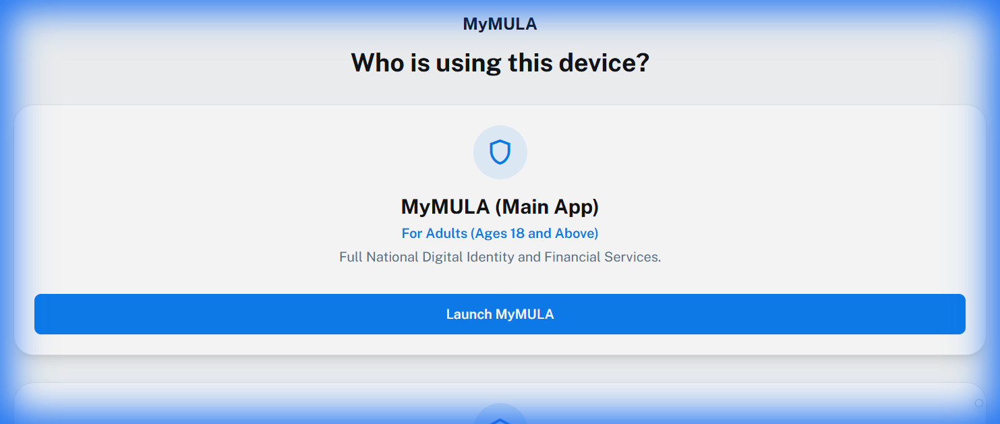

# 🛡️ MyMULA Junior

<div align="center">



**Malaysia's First Digital Legal Guardian Protocol**

*Replacing paperwork with instant biometric consent for business, healthcare, education, and online safety.*

[](https://opensource.org/licenses/MIT)
[](https://developer.mozilla.org/en-US/docs/Web/HTML)
[](https://tailwindcss.com/)
[](https://python.org)

[Live Demo](https://eavan127.github.io/MyMULA-Junior/) · [Report Bug](https://github.com/eavan127/MyMULA-Junior/issues) · [Request Feature](https://github.com/eavan127/MyMULA-Junior/issues)

</div>

---

## 📋 Table of Contents

- [About The Project](#-about-the-project)
- [Key Features](#-key-features)
- [System Architecture](#-system-architecture)
- [Demo Flows](#-demo-flows)
- [Getting Started](#-getting-started)
- [Project Structure](#-project-structure)
- [AI Chatbot Setup](#-ai-chatbot-setup)
- [Technology Stack](#-technology-stack)
- [Contributing](#-contributing)
- [License](#-license)
- [Contact](#-contact)

---

## 🎯 About The Project

**MyMULA Junior** is a revolutionary digital identity platform designed to bridge the gap between minors and essential services in Malaysia. It introduces a **Digital Legal Guardian Protocol** that enables youth (under 18) to access business registration, healthcare, education scholarships, and online safety features—all with secure, real-time guardian consent.

### 🌟 The Problem We Solve

Traditional processes for minors accessing government services require:
- 📝 Physical paperwork and manual signatures
- 🚗 Multiple in-person visits with guardians
- ⏳ Long processing times (days to weeks)
- 🔒 Security vulnerabilities with paper documents

### 💡 Our Solution

MyMULA Junior provides:
- ⚡ **Instant biometric consent** via Face ID verification
- 📱 **Real-time push notifications** for guardian approval
- 🔐 **Secure digital signatures** with cryptographic verification
- 🌐 **24/7 accessibility** from any device

---

## ✨ Key Features

### 🧒 For Junior Users (Under 18)

| Feature | Description |
|---------|-------------|
| **📚 Scholarship Applications** | Apply for PESP and other educational funding with guardian approval |
| **🏢 SME Registration** | Register small/medium enterprises (ages 16+) with parental consent |
| **🏥 Healthcare Consent** | Digital consent for dental checkups and medical procedures |
| **🎮 Transaction Approval** | Request guardian permission for age-restricted purchases |
| **📄 Document Management** | Scan, upload, and manage identity documents (MyKad, Passport) |
| **🤖 AI Assistant** | Get help navigating the app with our Gemini-powered chatbot |
| **🌐 Multi-language Support** | Accessible in multiple languages via Google Translate |

### 👨‍👩‍👧 For Guardian/Adult Users

| Feature | Description |
|---------|-------------|
| **👶 Linked Children** | View and manage all linked minor accounts |
| **📩 Request Management** | Approve or reject pending requests with biometric verification |
| **⏰ Digital Curfew** | Set device usage restrictions during specific hours |
| **📊 Activity Dashboard** | Monitor recent activities and application statuses |
| **🔔 Push Notifications** | Receive instant alerts for pending approvals |
| **📋 Document Verification** | View and verify linked children's documents |

---

## 🏗️ System Architecture

```
┌─────────────────────────────────────────────────────────────┐
│                        MyMULA Platform                       │
├────────────────────────┬────────────────────────────────────┤
│    MyMULA Junior App   │         MyMULA Adult App           │
│    (Youth Under 18)    │        (Guardians 18+)             │
├────────────────────────┼────────────────────────────────────┤
│ • Home Dashboard       │ • Home Dashboard                   │
│ • Applications         │ • Request Management               │
│ • Profile & Documents  │ • Profile & Documents              │
│ • AI Chatbot           │ • Digital Curfew Settings          │
│ • Notifications        │ • Linked Children View             │
└────────────────────────┴────────────────────────────────────┘
                              │
                              ▼
┌─────────────────────────────────────────────────────────────┐
│                    Backend Services                          │
├─────────────────────────────────────────────────────────────┤
│ • AI Chatbot Server (Python/Flask + Google Gemini)          │
│ • Session/Local Storage (Demo Data Persistence)             │
│ • Mock Government Data (Identity Verification)              │
└─────────────────────────────────────────────────────────────┘
```

---

## 🔄 Demo Flows

### 1️⃣ Scholarship Application Flow
```
Junior: Browse Scholarships → Select PESP → Fill Requirements 
      → Request Guardian Signature → Wait for Approval
      
Guardian: Receive Notification → Review Application 
        → Biometric Verification → Approve/Reject
        
Junior: Receive Confirmation → Track Progress → Complete Application
```

### 2️⃣ SME Registration Flow (Ages 16+)
```
Junior: Select SME Registration → Complete Form A 
      → Business Details → Guardian Approval Required

Guardian: Review Business Plan → Digital Signature 
        → Face ID Verification → Approve

Junior: Registration Submitted → Track Progress → Receive Confirmation
```

### 3️⃣ Healthcare Consent Flow
```
Junior: Select Healthcare → Choose Dental Checkup 
      → Submit Medical History → Request Consent

Guardian: Review Medical Details → Approve Consent 
        → Clinic Receives Authorization

Clinic: Verify Consent → Schedule Appointment → Provide Service
```

### 4️⃣ Transaction Approval Flow
```
System: Detect Age-Restricted Purchase → Intercept Transaction

Junior: View Blocked Transaction → Request Guardian Permission

Guardian: Review Purchase Details → Approve/Reject with Face ID

Junior: Transaction Proceeds (if approved) → Track Status
```

---

## 🚀 Getting Started

### Prerequisites

- Web browser (Chrome, Firefox, Safari, Edge)
- Python 3.8+ (for AI chatbot feature)
- Git (for cloning)

### Installation

1. **Clone the repository**
   ```bash
   git clone https://github.com/eavan127/MyMULA-Junior.git
   cd MyMULA-Junior
   ```

2. **Open the application**
   - Simply open `index.html` in your web browser
   - Or use a local server:
     ```bash
     # Using Python
     python -m http.server 8000
     
     # Using Node.js
     npx serve .
     ```

3. **Access the app**
   - Navigate to `http://localhost:8000` (or just open `index.html`)
   - Choose between **MyMULA** (Adult) or **MyMULA Junior** (Youth)

### Quick Start Demo

1. **As a Junior User:**
   - Click "Launch MyMULA Junior"
   - Register with demo IC: `071215-14-1234`
   - Explore scholarship applications and features

2. **As an Adult/Guardian:**
   - Click "Launch MyMULA"
   - Register with demo IC: `850612-10-5234`
   - View linked children and approve requests

---

## 📁 Project Structure

```
MyMULA-Junior/
├── 📄 index.html                    # Main entry point (app selector)
├── 📄 myMULA_junior.html            # Junior app entry
├── 📄 myMULA_guardian.html          # Guardian app entry
├── 📄 myMULA_adult.html             # Adult registration
│
├── 📂 Junior App Pages
│   ├── mainpage_home.html           # Junior home dashboard
│   ├── mainpage_applications.html   # Applications list
│   ├── mainpage_profile.html        # Profile & documents
│   ├── junior_registration.html     # Registration flow
│   ├── Notification.html            # Notifications center
│   ├── ai_chatbox.html              # AI assistant interface
│   └── link_guardian.html           # Guardian linking
│
├── 📂 Scholarship Module
│   ├── scholarship_application.html
│   ├── scholarship_requirements.html
│   ├── scholarship_view_document.html
│   ├── guardian_signature_comfirmation.html
│   └── progress_tracker.html
│
├── 📂 SME Module
│   ├── SME_Registration.html
│   ├── SME_Application_Requirements.html
│   ├── SME_Guardian_Approval.html
│   ├── SME_Digital_Signature.html
│   ├── SME_view_document.html
│   └── SME_Application_Progress_Tracker.html
│
├── 📂 Healthcare Module
│   ├── Dental_Healthcare_Consent.html
│   ├── Dental_Application_Requirements.html
│   ├── Dental_Guardian_Approval.html
│   ├── Dental_Digital_Signature.html
│   ├── Dental_view_document.html
│   └── Dental_Progress_Tracker.html
│
├── 📂 Transaction Module
│   ├── Transaction_intercepted.html
│   ├── Transaction_guardian_approval.html
│   ├── Transaction_Digital_Signature.html
│   ├── Transaction_Summary.html
│   └── Transaction_Progress_Tracker.html
│
├── 📂 Digital Curfew Module
│   ├── digital_curfew.html
│   ├── digital_curfew_settings_saved.html
│   └── Digital_curfew_setting_summary.html
│
├── 📂 Age Verification Module
│   ├── Age_Login.html
│   ├── Age_Digital_Control.html
│   ├── Age_Transaction_Approval.html
│   ├── Age_Request_Transaction.html
│   ├── Age_Signature_Approval.html
│   ├── Age_Approval_Details.html
│   └── Age_Progress_Tracker.html
│
├── 📂 Adult/Guardian App Pages
│   ├── adult_home.html              # Guardian dashboard
│   ├── adult_profile.html           # Guardian profile
│   ├── adult_requests.html          # Pending requests
│   ├── adult_notification.html      # Notifications
│   ├── Linked_children.html         # Children management
│   └── request_received_guardian.html
│
├── 📂 Document Management
│   └── scan_document.html           # Document scanner
│
├── 📂 Legal & Policies
│   ├── Privacy_and_Security.html
│   ├── Privacy_policy.html
│   └── Term_of_Service.html
│
├── 📂 Backend & Data
│   ├── py_chatbot_server.py         # AI chatbot server
│   ├── backend_api.py               # Mock API
│   ├── mock_data.json               # Application data
│   ├── mock_profile_data.json       # User profiles
│   ├── google_translate.js          # Translation module
│   └── Start_MyMULA_AI.bat          # Chatbot launcher (Windows)
│
├── 📂 Assets
│   └── preview_image.png            # Social preview image
│
└── 📄 README.md                     # This file
```

---

## 🤖 AI Chatbot Setup

The AI chatbot is powered by **Google Gemini API** and requires a Python backend.

### Setup Instructions

1. **Install dependencies**
   ```bash
   pip install flask flask-cors google-generativeai
   ```

2. **Configure API Key**
   - Get your API key from [Google AI Studio](https://makersuite.google.com/app/apikey)
   - Update `py_chatbot_server.py` with your key:
     ```python
     API_KEY = "your-api-key-here"
     ```

3. **Start the server**
   ```bash
   python py_chatbot_server.py
   ```
   
   Or use the batch file (Windows):
   ```bash
   Start_MyMULA_AI.bat
   ```

4. **Access the chatbot**
   - Navigate to `ai_chatbox.html` in the Junior app
   - The chatbot will connect to `http://localhost:5000`

### Chatbot Capabilities

- 📖 Explain guardian linking process
- 🔐 Describe approval workflows
- 📄 Guide document uploads
- ❓ Answer general app questions

---

## 🛠️ Technology Stack

| Category | Technologies |
|----------|-------------|
| **Frontend** | HTML5, CSS3, JavaScript (ES6+) |
| **Styling** | Tailwind CSS, Material Symbols |
| **Typography** | Google Fonts (Public Sans, Inter) |
| **Backend** | Python, Flask |
| **AI/ML** | Google Gemini API |
| **Storage** | localStorage, sessionStorage |
| **Internationalization** | Google Translate API |

---

## 🤝 Contributing

Contributions are what make the open source community such an amazing place to learn, inspire, and create. Any contributions you make are **greatly appreciated**.

1. Fork the Project
2. Create your Feature Branch (`git checkout -b feature/AmazingFeature`)
3. Commit your Changes (`git commit -m 'Add some AmazingFeature'`)
4. Push to the Branch (`git push origin feature/AmazingFeature`)
5. Open a Pull Request

### Development Guidelines

- Follow existing code style and naming conventions
- Test on multiple browsers (Chrome, Firefox, Safari)
- Ensure responsive design works on mobile devices
- Update documentation for any new features

---

## 📄 License

Distributed under the MIT License. See `LICENSE` for more information.

---

## 📞 Contact

**Project Maintainers:**

- **GitHub:** [@eavan127](https://github.com/eavan127)
- **Project Link:** [https://github.com/eavan127/MyMULA-Junior](https://github.com/eavan127/MyMULA-Junior)
- **Live Demo:** [https://eavan127.github.io/MyMULA-Junior/](https://eavan127.github.io/MyMULA-Junior/)

---

## 🙏 Acknowledgments

- [Tailwind CSS](https://tailwindcss.com/) - Utility-first CSS framework
- [Google Material Symbols](https://fonts.google.com/icons) - Icon library
- [Google Gemini AI](https://ai.google.dev/) - AI chatbot backend
- [Flask](https://flask.palletsprojects.com/) - Python web framework

---

<div align="center">

Made with ❤️ for Malaysia's Digital Future

**🇲🇾 Memperkasa Generasi Digital Malaysia 🇲🇾**

*Empowering Malaysia's Digital Generation*

</div>
